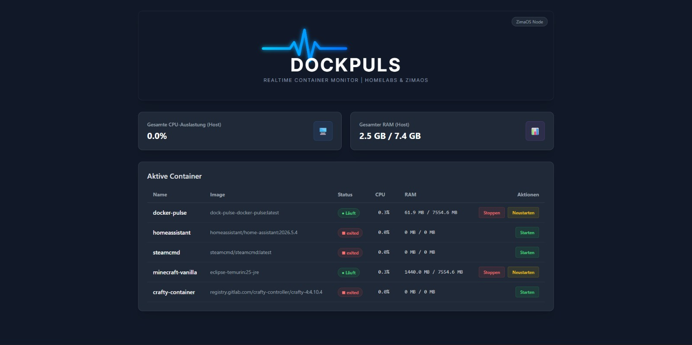

<div align="center">

# ⚡ DockPuls

### Der schlanke Realtime-Container-Monitor für Homelabs & ZimaOS.

<p align="center">
  
</p>

[](https://www.python.org/)
[](https://flask.palletsprojects.com/)
[](https://tailwindcss.com/)
[](https://www.docker.com/)
[](LICENSE)

**DockPuls befindet sich aktuell in Early Access.**

</div>

---

## 🚀 Über DockPuls

DockPuls ist ein schlanker und minimalistischer Realtime-Monitor für Docker-Container, entwickelt für **Homelabs und ZimaOS**.

Statt überladener Monitoring-Lösungen konzentriert sich DockPuls auf das Wesentliche:

* 📊 CPU- und RAM-Auslastung
* 🐳 Übersicht aller Docker-Container
* 🟢 Live-Status der Container
* 🔄 Automatische Aktualisierung
* ⏱️ Refresh-Countdown
* ▶️ Container starten
* ⏹️ Container stoppen
* 🔁 Container neu starten
* 🖥️ Host-Ressourcen auf einen Blick

DockPuls ist **Open Source** und wird aktiv weiterentwickelt.

> ⚠️ DockPuls befindet sich derzeit im Early Access.
> Funktionen und Oberfläche können sich daher noch verändern.

---

## ✨ Features

### 🐳 Container Monitoring

DockPuls zeigt alle Docker-Container des Hosts übersichtlich in einem Dashboard.

Angezeigt werden unter anderem:

* Container-Name
* Docker-Image
* Status
* CPU-Auslastung
* RAM-Auslastung

### 🖥️ Host Monitoring

Zusätzlich werden wichtige Ressourcen des Hosts angezeigt:

* Gesamte CPU-Auslastung
* Gesamter RAM
* verwendeter RAM
* verfügbarer RAM

### 🎮 Container-Steuerung

Container können direkt aus dem Dashboard verwaltet werden:

* Starten
* Stoppen
* Neustarten

### 🔄 Live-Aktualisierung

Das Dashboard aktualisiert sich automatisch.

Ein Countdown zeigt an, wann die nächste Aktualisierung durchgeführt wird.

---

## 📸 Dashboard

<p align="center">
  
</p>

---

## 🚀 Installation

### Voraussetzungen

Für die Docker-Installation benötigst du:

* Docker
* Docker Compose
* Git

### Repository klonen

```bash
git clone https://github.com/lennyklein/DockPuls.git
cd DockPulse/dock-pulse
```

### DockPuls starten

```bash
docker compose up -d --build
```

Nach dem Start ist DockPuls unter folgender Adresse erreichbar:

```text
http://SERVER-IP:5000
```

Ersetze `SERVER-IP` durch die IP-Adresse deines Servers.

Beispiel:

```text
http://192.168.***.**:5000
```

---

## 🐳 Docker

DockPuls kann vollständig über Docker betrieben werden.

Der Container wird mit folgendem Befehl gestartet:

```bash
docker compose up -d --build
```

Status des Containers prüfen:

```bash
docker compose ps
```

Logs anzeigen:

```bash
docker compose logs -f
```

DockPuls stoppen:

```bash
docker compose down
```

Nach Änderungen am Projekt kann das Image neu gebaut werden:

```bash
docker compose up -d --build
```

---

## 🔌 Docker Socket

DockPuls benötigt Zugriff auf den Docker-Socket des Hosts, um Container überwachen und steuern zu können.

Die `docker-compose.yml` verwendet dafür:

```yaml
volumes:
  - /var/run/docker.sock:/var/run/docker.sock
```

Dadurch kann DockPuls:

* Docker-Container erkennen
* Container-Status auslesen
* CPU- und RAM-Werte abrufen
* Container starten
* Container stoppen
* Container neustarten

> ⚠️ **Sicherheitshinweis:** Der Zugriff auf den Docker-Socket ermöglicht weitreichende Kontrolle über Docker auf dem Host. Stelle sicher, dass DockPuls nicht ungeschützt aus dem Internet erreichbar ist.

---

## ⚙️ Konfiguration

Die Docker-Konfiguration befindet sich in:

```text
docker-compose.yml
```

Beispiel:

```yaml
services:
  docker-pulse:
    build: .
    container_name: docker-pulse
    restart: unless-stopped
    ports:
      - "5000:5000"
    volumes:
      - /var/run/docker.sock:/var/run/docker.sock
```

### Discord Webhook

Eine Discord-Webhook-Integration ist bereits für die zukünftige Entwicklung vorgesehen.

Die Konfiguration kann später beispielsweise über eine Umgebungsvariable erfolgen:

```yaml
environment:
  - DISCORD_WEBHOOK_URL=dein_webhook_hier_einfügen
```

> Die Discord-Benachrichtigungen befinden sich aktuell noch in Entwicklung.

---

## 🛠️ Entwicklung

DockPuls verwendet aktuell folgende Technologien:

| Technologie  | Verwendung               |
| ------------ | ------------------------ |
| Python 3.11+ | Backend                  |
| Flask        | Webserver / API          |
| Docker SDK   | Kommunikation mit Docker |
| psutil       | Host-Ressourcen          |
| TailwindCSS  | Benutzeroberfläche       |
| Docker       | Deployment               |

### Projektstruktur

```text
DockPulse/
├── dock-pulse/
│   ├── src/
│   │   ├── app.py
│   │   └── monitor.py
│   ├── templates/
│   │   └── index.html
│   ├── Dockerfile
│   ├── docker-compose.yml
│   └── requirements.txt
├── screenshots/
│   └── dashboard.png
├── LICENSE
└── README.md
```

---

## 🗺️ Roadmap

### ✅ Bereits verfügbar

* [x] Container-Übersicht
* [x] Running / Stopped Status
* [x] CPU-Auslastung
* [x] RAM-Auslastung
* [x] Host-Ressourcen
* [x] Live-Auto-Refresh
* [x] Refresh-Countdown
* [x] Container starten
* [x] Container stoppen
* [x] Container neustarten
* [x] Docker-Deployment

### 🚧 In Entwicklung

* [ ] Discord-Webhook-Benachrichtigungen
* [ ] Container-Logs
* [ ] Detaillierte Container-Ansicht
* [ ] Verbesserte Fehlererkennung
* [ ] Mobile Optimierung

### 🔮 Geplant

* [ ] Plugin-System
* [ ] Community-Plugins
* [ ] Erweiterte Statistiken
* [ ] Historische CPU-/RAM-Werte
* [ ] Weitere Homelab-Integrationen

---

## 🧩 Plugin-System

Eine der geplanten Kernfunktionen von DockPuls ist ein **erweiterbares Plugin-System**.

Dadurch sollen Entwickler zukünftig eigene Plugins für DockPuls entwickeln und mit der Community teilen können.

Mögliche zukünftige Plugins könnten beispielsweise sein:

* zusätzliche Monitoring-Dienste
* Benachrichtigungen
* weitere Homelab-Systeme
* externe APIs
* zusätzliche Dashboard-Widgets

Das Plugin-System befindet sich derzeit noch in der Planung.

---

## 🤝 Mitmachen

DockPuls befindet sich noch in einer frühen Entwicklungsphase.

Beiträge aus der Community sind willkommen.

Du kannst beispielsweise:

* 🐛 Bugs melden
* 💡 Feature-Ideen vorschlagen
* 📝 Dokumentation verbessern
* 🔧 Pull Requests erstellen
* 🧩 zukünftig eigene Plugins entwickeln

### Bug melden

Wenn du einen Fehler gefunden hast, erstelle bitte ein **Issue** und beschreibe möglichst genau:

1. Was ist passiert?
2. Was hast du erwartet?
3. Welche Version verwendest du?
4. Welche Umgebung verwendest du?
5. Gibt es relevante Fehlermeldungen oder Logs?

### Feature vorschlagen

Neue Ideen können ebenfalls über ein **Issue** vorgeschlagen werden.

Beschreibe dabei möglichst genau, welches Problem die Funktion lösen soll.

---

## ⭐ Unterstützung

Wenn dir DockPuls gefällt oder du das Projekt interessant findest:

⭐ Gib dem Repository einen **Star** auf GitHub.

🐛 Melde gefundene Fehler.

💡 Teile deine Ideen und Verbesserungsvorschläge.

🤝 Unterstütze das Projekt mit Pull Requests.

---

## ⚠️ Early Access

DockPuls befindet sich aktuell im **Early Access**.

Das bedeutet:

* Funktionen können sich verändern.
* Das Design kann angepasst werden.
* APIs können sich ändern.
* Neue Funktionen werden laufend hinzugefügt.
* Fehler können auftreten.

Für produktive Umgebungen solltest du das Projekt entsprechend absichern und testen.

---

## 📄 Lizenz

DockPuls steht unter der **[MIT License](LICENSE)**.

---

<div align="center">

### ⚡ DockPuls

**Realtime Docker Monitoring für Homelabs & ZimaOS.**

Made with ❤️ by **Lenny Klein**

</div>
